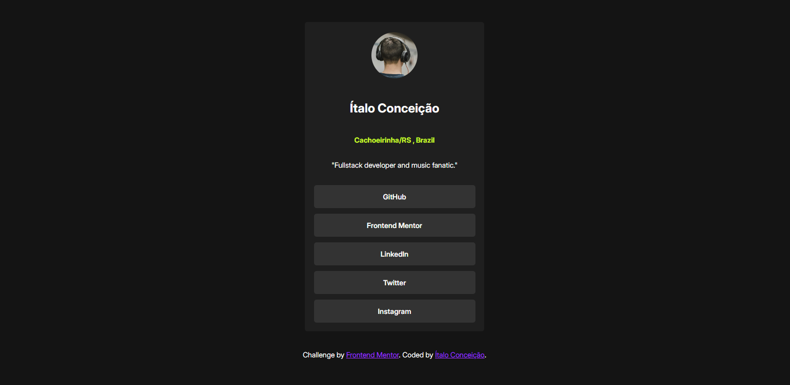

# Frontend Mentor - Social links profile  

## The challenge

Your challenge is to build out this social links profile and get it looking as close to the design as possible.

You can use any tools you like to help you complete the challenge. So if you've got something you'd like to practice, feel free to give it a go.

# My Version:
Visit Here https://italoconceicao.github.io/social-links-profile-main/

# The Original:

